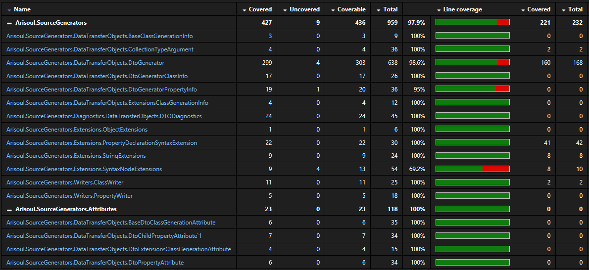

<!-- Improved compatibility of back to top link: See: https://github.com/othneildrew/Best-README-Template/pull/73 -->
<a id="readme-top"></a>
<!--
*** This template was copyied from <a href="https://github.com/othneildrew/Best-README-Template/tree/master">othneildrew/Best-README-Template</a>
*** Go there and give him a star :)
-->


<!-- PROJECT SHIELDS -->
<!--
*** I'm using markdown "reference style" links for readability.
*** Reference links are enclosed in brackets [ ] instead of parentheses ( ).
*** See the bottom of this document for the declaration of the reference variables
*** for contributors-url, forks-url, etc. This is an optional, concise syntax you may use.
*** https://www.markdownguide.org/basic-syntax/#reference-style-links
-->
[![Contributors][contributors-shield]][contributors-url]
[![Forks][forks-shield]][forks-url]
[![Stargazers][stars-shield]][stars-url]
[![Issues][issues-shield]][issues-url]
[![MIT License][license-shield]][license-url]
[![LinkedIn][linkedin-shield]][linkedin-url]

***

<!-- PROJECT LOGO -->
<br />
<div align="center">
  <a href="https://github.com/ARiSoul/Arisoul.SourceGenerators">
    
  </a>

<h3 align="center">Arisoul Source Generators</h3>

  <p align="center">
    This is a simple source generator for .Net C#, created with personal purposes, but it may grow as needed. For now, the only available generators are for DTO generation, and corresponding extensions that facilitate mappings. The extensions will only do simple mappings. For more complex scenarios, please use one of the many mappers out there.
    <br />
    <br />
    <a href="https://github.com/ARiSoul/Arisoul.SourceGenerators/issues/new?assignees=ARiSoul&labels=bug&template=bug_report.md&title=">Report Bug</a>
    ·
    <a href="https://github.com/ARiSoul/Arisoul.SourceGenerators/issues/new?assignees=ARiSoul&labels=enhancement&template=feature_request.md&title=">Request Feature</a>
    <br />
    <a href="#release-notes">Release Notes</a>
  </p>

[](https://www.nuget.org/packages/Arisoul.SourceGenerators/)
[](https://github.com/ARiSoul/Arisoul.SourceGenerators/actions/workflows/pipelines.yml)
</div>
</br>

<!-- TABLE OF CONTENTS -->
<details>
  <summary>Table of Contents</summary>
  <ol>
    <li>
      <a href="#about-the-project">About The Project</a>
      <ul>
        <li><a href="#built-with">Built With</a></li>
        <li><a href="#tests-coverage">Tests Coverage</a></li>
      </ul>
    </li>
    <li>
      <a href="#getting-started">Getting Started</a>
      <ul>
        <li><a href="#prerequisites">Prerequisites</a></li>
        <li><a href="#installation">Installation</a></li>
      </ul>
    </li>
    <li><a href="#usage">Usage</a></li>
    <li><a href="#release-notes">Release Notes</a></li>
    <li><a href="#roadmap">Roadmap</a></li>
    <li><a href="#contributing">Contributing</a></li>
    <li><a href="#license">License</a></li>
    <li><a href="#contact">Contact</a></li>
  </ol>
</details>


<!-- ABOUT THE PROJECT -->
# About The Project

I found myself many times creating **POCO** classes, or **Entity Models**, and then rewriting by hand new classes for the corresponding DTOs. I think that this a very boring task, so I decided to give the <a href="https://learn.microsoft.com/en-us/dotnet/csharp/roslyn-sdk/source-generators-overview">**.Net Source Generators**</a> a try, and do some of that job for me. I then understood that using <a href="https://automapper.org/">**AutoMapper**</a>, <a href="https://github.com/MapsterMapper/Mapster">**Mapster**</a>, etc. it's all good and all, but why don't to try to generate some extensions helpers for the most simple scenarios?

The marker attribute to trigger the generation is called **DtoPropertyAttribute** and it's provided in the package through the **Arisoul.SourceGenerators.Attributes** dll that comes together. 

I intend to grow the package as needed to allow other generations, and make it better.

Of course, this is a very very simple tool, so don't be to hard on me 😃. Any suggestions or ideas are welcome, such as issues.

You can check some simple examples [here](#simple-examples). Also, check the [release notes](#release-notes) for more details.

<p align="right">(<a href="#readme-top">back to top</a>)</p>

## Built With

* [![csharp][c#]][csharp-url]
* [![React][netstandard20]][netstandard-url]
* [![.Net 7][.Net 7]][net7-url]
* [![xunit][xunit]][xunit-url]

<p align="right">(<a href="#readme-top">back to top</a>)</p>

## Tests Coverage
- Arisoul SourceGenerator is unit tested with <a href="https://xunit.net/">**xUnit**</a> and <a href="https://github.com/VerifyTests/Verify">**Verify**</a>
- To report the Visual Studio extension <a href="https://github.com/FortuneN/FineCodeCoverage">**Fine Code Coverage**</a> is used
- 40 tests at the moment with a coverage more than ***97%*** as you can see below



<p align="right">(<a href="#readme-top">back to top</a>)</p>


<!-- GETTING STARTED -->
# Getting Started

## Prerequisites

- It only generates C# code
- Compatible with all .Net Frameworks since 4.6.1

## Installation

Choose how to install the package:

* .NET CLI
  ```sh
  dotnet add package Arisoul.SourceGenerators --version 1.0.3
  ```

* Package Manager
  ```sh
  NuGet\Install-Package Arisoul.SourceGenerators -Version 1.0.3
  ```

* Directly in your .csproj
  ```sh
  <PackageReference Include="Arisoul.SourceGenerators" Version="1.0.3" />
  ```

* Or in Visual Studio, use the **Manage NuGet Packages...** option and search for **Arisoul** with the **Package Source** option as '**nuget.org**' or '**All**'

<p align="right">(<a href="#readme-top">back to top</a>)</p>


<!-- USAGE EXAMPLES -->
## Usage

1. Create a POCO class with the properties you want
2. Add ``` using Arisoul.SourceGenerators.DataTransferObjects; ```
3. Decorate the properties that you want to be included in the Dto class with the attribute ``` [DtoProperty] ```
4. That's it 👍 😃

- Now, you can use a class named **YourClassDto** with the corresponding properties
- The other generated class creates extensions for the DTO and the POCO class, allowing to call ```dtoInstance = pocoInstance.ToDto()```, or ```pocoInstance.FromDto(dtoInstance)```, and the same reverse corresponding methods.
- If you want to provide your custom names for the generated DTO class properties, you can use the overload of the DtoPropertyAttribute, like so: ```[DtoProperty("PreferredName")]``` or ```[DtoProperty(Name = "OtherName")] ```

### Simple examples
</br>

- The POCO class:
```
using Arisoul.SourceGenerators.DataTransferObjects;

namespace DtoGenerator;

public class Person
{
    public int Id { get; set; }

    [DtoProperty("Name")]
    public string FirstName { get; set; }

    [DtoProperty]
    public string LastName { get; set; }

    [DtoProperty]
    public DateTime Date { get; set; }
}
```

- The generated DTO:
``` 
using System;

namespace DtoGenerator
{
    public partial class PersonDto
    {
        public virtual string Name { get; set; }
        public virtual string LastName { get; set; }
        public virtual global::System.DateTime Date { get; set; }
    }
}
```
- The generated extensions:
```
#nullable enable
/*  <auto-generated> ------------------------------------------------------------------------------ 
        This code was generated by Arisoul.SourceGenerators tool.
        Changes to this file may cause incorrect behavior and will be lost if
        the code is regenerated.
    </auto-generated> ------------------------------------------------------------------------------*/

using System;

namespace DtoGenerator
{
    public static partial class PersonExtensions
    {
        public static PersonDto ToDto(this Person poco)
        {
            PersonDto dto = new PersonDto();

            dto.Name = poco.FirstName;
            dto.LastName = poco.LastName;
            dto.Date = poco.Date;

            return dto;
        }

        public static void FromDto(this Person poco, PersonDto dto)
        {
            poco.FirstName = dto.Name;
            poco.LastName = dto.LastName;
            poco.Date = dto.Date;
        }

        public static Person ToPoco(this PersonDto dto)
        {
            Person poco = new Person();

            poco.FirstName = dto.Name;
            poco.LastName = dto.LastName;
            poco.Date = dto.Date;

            return poco;
        }

        public static void FromPoco(this PersonDto dto, Person poco)
        {
            dto.Name = poco.FirstName;
            dto.LastName = poco.LastName;
            dto.Date = poco.Date;
        }
    }
}
```

- Other options:
  - ```DtoClassGenerationAttribute```
    - This is a class level decorator that provides a way to set a custom class name for the generated one, as also a custom namespace
    - The default values are:
      - Class name: **YourClassDto** 
      - Namespace: same as your original class
    - Both parameters are optional
    - Example:
    ```
    [DtoClassGeneration(Name = ""PersonCustom"", Namespace = ""CustomNamespace"")]
    public class Person
    {
        public int Id { get; set; }

        [DtoProperty(""CustomName"")]
        public string FirstName { get; set; }

        [DtoProperty]
        public string LastName { get; set; }
    }";

    // this will generate:

    namespace CustomNamespace
    {
      public partial class PersonCustom
      {
          public virtual string CustomName { get; set; }
          public virtual string LastName { get; set; }
      }
    }

    ```
  - ```DtoExtensionsClassGenerationAttribute```
    - Same as the ```DtoClassGenerationAttribute```, but with the added option to control its generation.
    - The additional parameter is of type ```Arisoul.SourceGenerators.DataTransferObjects.DtoGenerationBehavior``` that is an enum allowing the following behaviours:
      - **Full**: This is the default value. It will generate extensions for Dto and Poco classes, with methods To and For for both.
      - **OnlyDto**: Generates only extension for Dto class. dto.FromPoco(poco) and dto.ToPoco() will be generated.
      - **OnlyPoco**: Generates only extension for Poco class. poco.FromDto(dto) and poco.ToDto() will be generated.
      - **OnlyToMethods**: Only dto.ToPoco() and poco.ToDto() will be generated.
      - **OnlyFromMethods**: Only dto.FromPoco(poco) and poco.FromDto(dto) will be generated.
      - **NoGeneration**: No extensions class will be generated. There are already a lot of mappers packages out there, and you are free to use one of them.
    - All parameters are optional
    - Example:
    ```
    [DtoClassGeneration(Name = ""PersonCustom"", Namespace = ""CustomNamespace"")]
    [DtoExtensionsClassGeneration(Name = "CustomPersonExtensions", GenerationBehavior = GenerationBehavior.OnlyPoco)]
    public class Person
    {
        public int Id { get; set; }

        [DtoProperty("CustommName")]
        public string FirstName { get; set; }

        [DtoProperty]
        public string LastName { get; set; }
    }

    // this will generate

    public static partial class CustomPersonExtensions
    {
        public static CustomNamespace.PersonCustom ToDto(this Person poco)
        {
            CustomNamespace.PersonCustom dto = new CustomNamespace.PersonCustom();

            dto.TestAgain = poco.FirstName;
            dto.LastName = poco.LastName;

            return dto;
        }

        public static void FromDto(this Person poco, CustomNamespace.PersonCustom dto)
        {
            poco.FirstName = dto.TestAgain;
            poco.LastName = dto.LastName;
        }
    }

    ```

  - ```DtoChildPropertyAttribute<T>```
    - Other property decorator that allows to define that the generated type of the child property must be of the specified T
    - The child property must be a class with a parametless constructor
    - Use case: a child property that will have a corresponding Dto, so you will want to use that in your generated code
    - Example:
    ```
    public class Person
    {
        // this property is of type Person here, but in the generated Dto, will be of type DomainPerson
        [DtoChildProperty<DomainPerson>]
        public Person Child { get; set; }
        
        public Guid Id { get; set; }

        [DtoProperty]        
        public string Name { get; set; }
    
        [DtoProperty]
        public string Description { get; set; }
    }

    public class DomainPerson
    {
        public int Id { get; set; }
    }    
    ```
    - It can only be used with the class attribute ```[DtoExtensionsClassGeneration(GenerationBehavior = GenerationBehavior.NoGeneration)]```
    - The extensions class will not be generated, because this dto generator is focused in Dto generation, and the mappings are very simple. You can still use an existing mapping tool for that purposes. The generated class is partial, so you can extend it and add your desired type to use in mappings.
    
    </br>

### But... where are the generated classes?

- #### If you're targeting .NetStandard or other above (.Net Core, .Net 5, 6, 7, etc...)
  - Below your project in the Solution Explorer, expand Dependencies
  - Expand Analyzers > Arisoul.SourceGenerators > Arisoul.SourceGenerators.DataTransferObjects.DtoGenerator
  - There they are 👍

- #### For older .Net Framework since 4.6.1
  - Below your project in the Solution Explorer, expand References
  - Expand Analyzers > Arisoul.SourceGenerators > Arisoul.SourceGenerators.DataTransferObjects.DtoGenerator
  - There they are 👍

  </br>

## Persisting generated files in disk
- For more information about this, check this link: [Saving source generator output in source control](https://andrewlock.net/creating-a-source-generator-part-6-saving-source-generator-output-in-source-control/)
- Here's what you need to add to your .csproj. Feel free to edit to your needs. Thanks to [**Andrew Lock**](https://github.com/andrewlock) for such an amazing [tutorial series](https://andrewlock.net/series/creating-a-source-generator/):
```
<!--##### Generated files persistence in disk #####-->
<PropertyGroup>
<!--Persist the source generator (and other) files to disk--> 
    <EmitCompilerGeneratedFiles>true</EmitCompilerGeneratedFiles>
<!--The "base" path for the source generators--> 
    <GeneratedFolder>Generated</GeneratedFolder>
<!--Write the output for each target framework to a different sub-folder--> 
    <CompilerGeneratedFilesOutputPath>$(GeneratedFolder)\$(TargetFramework)</CompilerGeneratedFilesOutputPath>
</PropertyGroup>

<ItemGroup>
<!-- Exclude everything in the base folder--> 
    <Compile Remove="$(GeneratedFolder)/**/*.cs" />
</ItemGroup>
```

</br>

- ### Usage Demo
```
    public void Demo()
    {
        // Create an instance of the POCO class
        Person pocoPerson = new Person();

        // Map to a DTO (extension)
        PersonDto dtoPerson = pocoPerson.ToDto();

        // Reverse mapping using the POCO extension
        pocoPerson.FromDto(dtoPerson);

        // Other reverse mapping using the DTO extension
        pocoPerson = dtoPerson.ToPoco();
        
        // Fill the DTO with the POCO (another extension way)
        dtoPerson.FromPoco(pocoPerson);
    }
```

_Read the [release notes](#release-notes) form more information. If you need more examples, please, let me now. And remember, this has a lot to improve._

<p align="right">(<a href="#readme-top">back to top</a>)</p>

# Release Notes
- [v1.0.3 (09/04/2023)](https://github.com/ARiSoul/Arisoul.SourceGenerators/blob/master/CHANGELOG.md#v103)
- [v1.0.2 (08/04/2023)](https://github.com/ARiSoul/Arisoul.SourceGenerators/blob/master/CHANGELOG.md#v102)
- [v1.0.1 (03/04/2023)](https://github.com/ARiSoul/Arisoul.SourceGenerators/blob/master/CHANGELOG.md#v101)
- [v1.0.0 (29/03/2023)](https://github.com/ARiSoul/Arisoul.SourceGenerators/blob/master/CHANGELOG.md#v100)

<p align="right">(<a href="#readme-top">back to top</a>)</p>

<!-- ROADMAP -->
# Roadmap

- [x] Allow to set generated classes names
- [x] Allow to set classes to generate
- [x] Allow to set namespace in each generated class
- [x] Allow generated files persisting in disk
- [x] Add a type converter option
- [ ] More to come

See the [open issues](https://github.com/Arisoul/Arisoul.SourceGenerators/issues) for a full list of proposed features (and known issues).

<p align="right">(<a href="#readme-top">back to top</a>)</p>


<!-- CONTRIBUTING -->
# Contributing

Contributions are what make the open source community such an amazing place to learn, inspire, and create. Any contributions you make are **greatly appreciated**.

If you have a suggestion that would make this better, please fork the repo and create a pull request. You can also simply open an issue with the tag "enhancement".
Don't forget to give the project a ⭐ ! Thanks again ❤️ !

1. Fork the Project
2. Create your Feature Branch (`git checkout -b feature-your-feature`)
3. Commit your Changes (`git commit -m 'Amazing commit'`)
4. Push to the Branch (`git push origin feature-your-feature`)
5. Open a Pull Request

<p align="right">(<a href="#readme-top">back to top</a>)</p>


<!-- LICENSE -->
# License

Distributed under the MIT License. See `LICENSE.txt` for more information.

<p align="right">(<a href="#readme-top">back to top</a>)</p>


<!-- CONTACT -->
# Contact

Ricardo Sousa - rjr.sousa0915@gmail.com

Project Link: [https://github.com/ARiSoul/Arisoul.SourceGenerators](https://github.com/ARiSoul/Arisoul.SourceGenerators)

<p align="right">(<a href="#readme-top">back to top</a>)</p>

### This README template was copied from <a href="https://github.com/othneildrew/Best-README-Template/tree/master">othneildrew/Best-README-Template</a> and then modified/adapted by me
- Go there and give him a star ⭐


<!-- MARKDOWN LINKS & IMAGES -->
<!-- https://www.markdownguide.org/basic-syntax/#reference-style-links -->
[contributors-shield]: https://img.shields.io/github/contributors/Arisoul/Arisoul.SourceGenerators.svg?style=for-the-badge
[contributors-url]: https://github.com/ARiSoul/Arisoul.SourceGenerators/graphs/contributors
[forks-shield]: https://img.shields.io/github/forks/Arisoul/Arisoul.SourceGenerators.svg?style=for-the-badge
[forks-url]: https://github.com/Arisoul/Arisoul.SourceGenerators/network/members
[stars-shield]: https://img.shields.io/github/stars/Arisoul/Arisoul.SourceGenerators.svg?style=for-the-badge
[stars-url]: https://github.com/Arisoul/Arisoul.SourceGenerators/stargazers
[issues-shield]: https://img.shields.io/github/issues/Arisoul/Arisoul.SourceGenerators.svg?style=for-the-badge
[issues-url]: https://github.com/Arisoul/Arisoul.SourceGenerators/issues
[license-shield]: https://img.shields.io/github/license/Arisoul/Arisoul.SourceGenerators.svg?style=for-the-badge
[license-url]: https://github.com/ARiSoul/Arisoul.SourceGenerators/blob/master/LICENSE.txt
[linkedin-shield]: https://img.shields.io/badge/-LinkedIn-black.svg?style=for-the-badge&logo=linkedin&colorB=555
[linkedin-url]: https://linkedin.com/in/rsousa1983
[product-screenshot]: images/screenshot.png
[c#]: https://img.shields.io/badge/c_sharp-white?style=for-the-badge&logo=csharp&logoColor=blueviolet
[csharp-url]: https://dotnet.microsoft.com/en-us/languages/csharp
[netstandard20]: https://img.shields.io/badge/standard_2.0-blue?style=for-the-badge&logo=dotnet&logoColor=white
[netstandard-url]: https://dotnet.microsoft.com/en-us/platform/dotnet-standard
[.Net 7]: https://img.shields.io/badge/7-blueviolet?style=for-the-badge&logo=dotnet&logoColor=white
[net7-url]: https://dotnet.microsoft.com/en-us/download/dotnet/7.0
[xunit]: https://img.shields.io/badge/xUnit-Tests-green
[xunit-url]: https://xunit.net/
